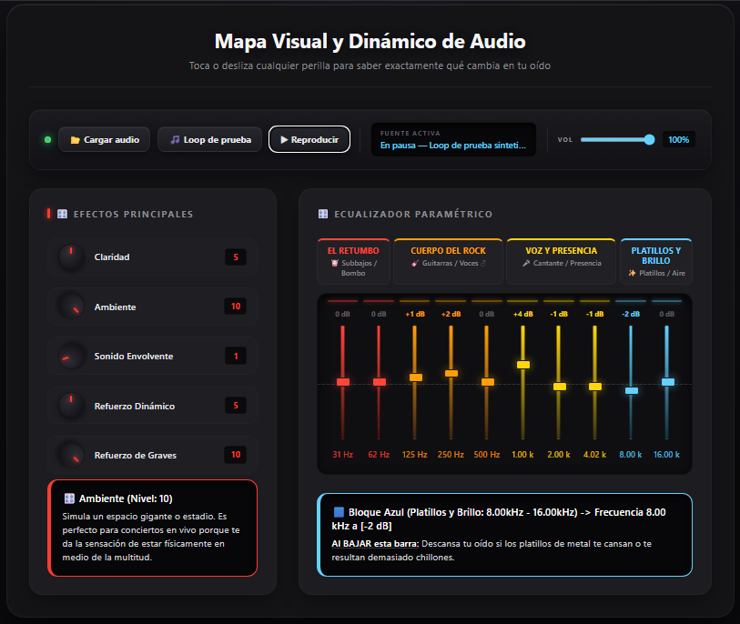

<a id="inicio"></a>
# 📘 Manual de Usuario — Consola de Audio FxSound



Bienvenido a la **wiki oficial** de la Consola de Audio FxSound. Este documento es la referencia completa de cada control, su efecto sobre el sonido y la forma correcta de usarlo.

> **Tags:** `#audio` `#web-audio-api` `#ecualizador` `#fxsound` `#neumorfismo` `#manual` `#tutorial` `#flac`

---

<a id="indice"></a>
## ️ Índice

1. [Introducción](#introduccion)
2. [Requisitos y puesta en marcha](#puesta-en-marcha)
3. [Barra de transporte](#transporte)
4. [Botón de Bypass](#bypass)
5. [Ecualizador de 10 bandas](#eq)
6. [Potenciómetros de efectos](#efectos)
7. [Volumen maestro](#volumen)
8. [Formatos de audio soportados](#formatos)
9. [Cómo funciona internamente](#interno)
10. [Solución de problemas](#problemas)
11. [Glosario](#glosario)
12. [Documentos relacionados](#relacionados)

---

<a id="introduccion"></a>
## 1. Introducción

La Consola de Audio FxSound es una aplicación web que **procesa audio real en tiempo real** usando la *Web Audio API* del navegador. A diferencia de un simulador visual, cada fader y cada potenciómetro modifica directamente un nodo del grafo de audio, por lo que el cambio se escucha al instante.

Su propósito es **didáctico**: ayuda a entender qué instrumentos o elementos de una mezcla se ven afectados al mover cada banda de frecuencia, y cómo los efectos alteran la percepción del sonido.

**Relacionado:** [Cómo funciona internamente](#interno) · [Formatos soportados](#formatos) · [Solución de problemas](#problemas)

---

<a id="puesta-en-marcha"></a>
## 2. Requisitos y puesta en marcha

### Requisitos

| Requisito | Detalle |
|-----------|---------|
| Navegador | Chrome, Brave, Edge, Firefox o Safari (versiones recientes) |
| Audio | Cualquier dispositivo de salida del sistema |
| Local | Servidor web local (Live Server, XAMPP, `python -m http.server`) |

> ⚠️ **Importante:** abrir el archivo directamente con `file:///` puede impedir la carga de recursos por las políticas *CORS*. Usa siempre un servidor local o la demo online.

### Pasos

1. Abre la aplicación en [la demo online](https://jimmynorman.github.io/mapa-interactivo-audio-fxsound/) o en tu servidor local.
2. Pulsa **📂 Cargar audio** y elige un archivo, **o** pulsa **🎵 Loop de prueba**.
3. Pulsa **▶ Reproducir**.
4. Ajusta los faders y potenciómetros a tu gusto.
5. Usa **⏻** (Bypass) para comparar con la señal original.

**Relacionado:** [Formatos de audio soportados](#formatos) · [Barra de transporte](#transporte)

---

#### Comandos útiles

```bash
# Servidor local con Python (sin instalar nada)
python -m http.server 8000

# Servidor local con Node.js
npx serve .

# Verificación del motor de audio (requiere Node.js)
node pruebas/motor-audio.test.js

# Verificación del visor de esta wiki
node pruebas/wiki.test.js
```

<a id="transporte"></a>
## 3. Barra de transporte

La barra superior agrupa **todo el control de reproducción y de fuente**.

| Control | Icono | Función |
|---------|-------|---------|
| Cargar audio | 📂 | Abre el selector de archivos locales del equipo. |
| Loop de prueba | 🎵 | Genera y reproduce una pista sintetizada de 8 s en bucle. |
| Reproducir / Pausar | ▶ / ⏸ | Alterna entre reproducir y pausar la pista actual. |
| Bypass | ⏻ | Activa o desactiva el procesamiento. Ver [Bypass](#bypass). |
| Detener | ■ | Detiene la reproducción y vuelve al inicio de la pista. |
| Retroceder | ⏮ 10s | Salta 10 segundos hacia atrás. |
| Avanzar | ⏩ 10s | Salta 10 segundos hacia adelante. |
| Barra de progreso | — | Muestra el avance; arrástrala para saltar a cualquier punto. |
| Tiempos | 0:00 | Tiempo transcurrido y duración total en formato `m:ss`. |
| Volumen | Vol | Nivel de salida general. Ver [Volumen maestro](#volumen). |

> 💡 **Consejo:** el loop de prueba incluye contenido grave, medio y agudo, más tonos de calibración a 1 kHz y 9 kHz. Es ideal para comprobar que cada banda del ecualizador realmente hace algo audible.

**Relacionado:** [Formatos de audio soportados](#formatos) · [Ecualizador de 10 bandas](#eq)

---

<a id="bypass"></a>
## 4. Botón de Bypass (⏻)

Es la herramienta más importante para **evaluar tus propios ajustes**.

| Estado | Comportamiento |
|--------|----------------|
| **Encendido** (por defecto) | La señal atraviesa toda la cadena: ecualizador, estanterías, compresor, matriz estéreo y reverberación. |
| **Apagado** (Bypass activo) | La señal salta por completo el procesamiento y va directa a la salida. |

### Cuándo usarlo

- Para comprobar si una mejora es real o solo un efecto placebo.
- Para verificar que no estás saturando o restando dinámica.
- Para diagnosticar si un problema de calidad viene del procesamiento o del archivo original.

> ⚠️ **Nota:** el Bypass **no** pierde la posición de los controles. Al reactivarlo, todos tus ajustes vuelven exactamente como estaban.

**Relacionado:** [Solución de problemas](#problemas) · [Cómo funciona internamente](#interno)

---

<a id="eq"></a>
## 5. Ecualizador de 10 bandas

Cada fader controla un filtro `BiquadFilter` de tipo *peaking* con ganancia entre **−12 dB y +12 dB**. La señal pasa por las 10 bandas **en serie**.

| # | Frecuencia | Bloque | Qué afecta |
|---|-----------|--------|------------|
| 1 | 31 Hz | 🟥 Rojo | Subbajos profundos, sensación física de retumbo. |
| 2 | 62 Hz |  Rojo | Bombo y bajo eléctrico. |
| 3 | 125 Hz | 🟧 Naranja | Cuerpo de percusión y voces masculinas graves. |
| 4 | 250 Hz |  Naranja | Calidez de guitarras y voces. |
| 5 | 500 Hz |  Naranja | Presencia de instrumentos de rango medio. |
| 6 | 1.00 kHz | 🟨 Amarillo | Intelligibilidad de la voz. |
| 7 | 2.00 kHz | 🟨 Amarillo | Consonantes (`s`, `t`); aquí vive la sibilancia. |
| 8 | 4.02 kHz |  Amarillo | Brillo y ataque de instrumentos. |
| 9 | 8.00 kHz | 🟦 Azul | Detalle de cuerdas y sensación de aire. |
| 10 | 16.00 kHz | 🟦 Azul | Armónicos superiores y espacio. |

### Cómo leer las cabeceras de color

Las cabeceras agrupan las bandas por *percepción*, no por número. Rojo = lo que se siente; Naranja = lo que da cuerpo; Amarillo = lo que se entiende; Azul = lo que brilla.

> 💡 **Consejo para voces:** si una grabación suena chillona al hablar, baja la banda de **2.00 kHz** en lugar de bajar todo el bloque amarillo.

> ⚠️ **Cuidado con el metal:** subir demasiado las bandas rojas crea un *bum bum* que enmascara las guitarras y hace perder definición.

**Relacionado:** [Potenciómetros de efectos](#efectos) · [Glosario](#glosario)

---

<a id="efectos"></a>
## 6. Potenciómetros de efectos

Los cinco potenciómetros se operan **arrastrando verticalmente** con el mouse o girando la **rueda de desplazamiento** sobre ellos. Rango `0`–`10`.

| Potenciómetro | Reposo | Al subir | Al bajar |
|---------------|--------|----------|----------|
| ️ **Claridad** | 4 | Resalta el detalle y las voces; en exceso aumenta el siseo `ssss`. | Sonido más opaco y oscuro. |
| ️ **Ambiente** | 3 | Simula un recinto amplio, tipo estadio; sensación de estar entre el público. | Sonido seco, directo y cerrado. |
| 🎛️ **Sonido Envolvente** | 3 | Separa los instrumentos de izquierda a derecha; efecto 3D para audífonos. | Concentra el sonido al centro, pierde espacialidad. |
| ️ **Refuerzo Dinámico** | 5 | Da más pegada (*punch*) y volumen uniforme. | El volumen decae y el sonido pierde impacto. |
| 🎛️ **Refuerzo de Graves** | 2 | Aumenta el bajo y los subbajos. | Quita el exceso de retumbo; útil en baterías rápidas. |

### Valores de reposo

Los valores de reposo **no son todos cero**. Están calibrados para que el sonido sea neutro en ellos:

- **Claridad = 4** y **Graves = 2** producen 0 dB de realce.
- **Envolvente = 3** equivale al estéreo original.
- **Dinámico = 5** aplica compresión moderada con ganancia unitaria.
- **Ambiente = 3** añade una reverberación sutil del 13.5 %.

> 💡 **Consejo:** si quieres partir de un sonido totalmente plano, usa **Bypass** ([ver sección](#bypass)) en lugar de intentar neutralizar cada potenciómetro.

**Relacionado:** [Bypass](#bypass) · [Ecualizador de 10 bandas](#eq)

---

<a id="volumen"></a>
## 7. Volumen maestro

El control `Vol` ajusta la **ganancia final de salida**, de 0 % a 100 %. Actúa *después* de todo el procesamiento.

- **No altera** el ecualizador, ni los efectos, ni la compresión.
- Sirve para igualar niveles al comparar con Bypass: si el procesamiento añade ganancia, percibirás un "suena mejor" que en realidad es "suena más fuerte".

> ⚠️ **Error común:** comparar procesado y original sin igualar el volumen. El oído prefiere lo más fuerte aunque suene peor. Ajusta `Vol` antes de juzgar.

**Relacionado:** [Bypass](#bypass) · [Solución de problemas](#problemas)

---

<a id="formatos"></a>
## 8. Formatos de audio soportados

La decodificación la realiza **el propio navegador**, sin códecs externos ni pérdida adicional. La consola entrega al `AudioContext` exactamente la señal PCM que el navegador decodifica.

| Formato | Soporte típico | Notas |
|---------|----------------|-------|
| `.flac` | ✅ Chrome, Brave, Edge, Firefox | Sin pérdida. Requiere navegador moderno. |
| `.wav` | ✅ Todos | Sin pérdida, archivos grandes. |
| `.mp3` | ✅ Todos | Con pérdida. |
| `.ogg` / `.opus` | ✅ Chrome, Brave, Firefox | Buen rendimiento y tamaño. |
| `.m4a` / `.aac` | ✅ Mayoría | Según licencias del sistema operativo. |

### Sobre la calidad percibida con FLAC

Si un archivo **sin pérdida** te suena peor que el original, las causas habituales son, por orden de probabilidad:

1. **Procesamiento activo.** Los efectos están aplicados. Usa [Bypass](#bypass) para comparar de forma justa.
2. **Compresión dinámica.** El potenciómetro *Refuerzo Dinámico* reduce la dinámica por diseño; en música ya masterizada puede sonar "aplastada".
3. **Ganancia.** El realce de bandas puede provocar saturación. Revisa el [Volumen maestro](#volumen).
4. **Configuración del sistema operativo.** Si Windows está fijado a 16 bits / 44.1 kHz, el sistema remuestrea todo antes de llegar a tus audífonos. Para material de alta resolución, ajusta el dispositivo a 24 bits / 48 kHz o superior.

> 📌 **Aclaración técnica:** la aplicación no "extrae códecs" ni recodifica. El navegador decodifica el archivo y la Web Audio API procesa la señal. La única alteración posible es la del procesamiento que tú mismo activas.

**Relacionado:** [Bypass](#bypass) · [Solución de problemas](#problemas) · [Cómo funciona internamente](#interno)

---

<a id="interno"></a>
## 9. Cómo funciona internamente

El grafo de audio se construye una sola vez, en el primer clic real del usuario (para respetar las políticas de *autoplay* del navegador).

### Cadena de procesamiento

```
Fuente (archivo o loop de prueba)
   │
   ├──► [Ruta directa] ──────────────────────────────────┐
   │                                                     │
   └──► EQ 10 bandas (peaking)                           │
          │                                              │
          ├─► Estantería de graves (lowshelf 90 Hz)       │
          ├─► Estantería de agudos (highshelf 6 kHz)      │
          ├─► Compresor dinámico (+ ganancia de pegada)   │
          ├─► Matriz Mid/Side (anchura estéreo)           │
          ├─► Reverb por convolución (seco + húmedo)      │
          └─► Volumen maestro ────────────────────────────┤
                                                          ▼
                                                    Salida (destination)
```

### Detalles técnicos

| Elemento | Implementación |
|----------|----------------|
| Entrada | `MediaElementAudioSourceNode` sobre un `<audio>` oculto |
| Ecualizador | 10 × `BiquadFilterNode` tipo `peaking`, Q = 1.4 |
| Graves / Claridad | `lowshelf` a 90 Hz y `highshelf` a 6 kHz |
| Dinámico | `DynamicsCompressorNode` (knee 12, attack 3 ms, release 250 ms) |
| Envolvente | `ChannelSplitter` + matriz M/S + `ChannelMerger` |
| Ambiente | `ConvolverNode` con respuesta impulsional sintética de 1.9 s |
| Bypass | Dos rutas en paralelo con ganancias complementarias |
| Suavizado | `setTargetAtTime` (15 ms) para evitar chasquidos |

**Relacionado:** [Bypass](#bypass) · [Ecualizador de 10 bandas](#eq) · [Verificación del motor](README.md#-verificación-del-motor-de-audio)

---

<a id="problemas"></a>
## 10. Solución de problemas

| Síntoma | Causa probable | Solución |
|---------|----------------|----------|
| No suena nada | El `AudioContext` está suspendido | Pulsa **▶ Reproducir** (el navegador exige un clic real). |
| Suena pero no cambia nada | Bypass activado | Pulsa **⏻** para reactivar el procesamiento. |
| El archivo no carga | Formato no soportado por el navegador | Convierte a FLAC, WAV, MP3 u OGG. |
| Suena saturado o distorsionado | Realce excesivo de bandas | Baja las bandas subidas y revisa el [Volumen](#volumen). |
| Suena "aplastado" | Compresión dinámica alta | Baja **Refuerzo Dinámico** hacia 5 o menos. |
| Se oye con eco metálico | Reverb excesiva | Baja **Ambiente**. |
| La imagen estéreo se oye rara | Anchura fuera de fase | Devuelve **Sonido Envolvente** a 3. |
| La wiki no se abre | Falta servir desde un servidor | Usa un servidor local; `file:///` bloquea la carga. |

> 💡 **Diagnóstico rápido:** activa [Bypass](#bypass). Si el problema desaparece, está en el procesamiento. Si persiste, está en el archivo o en el sistema.

**Relacionado:** [Bypass](#bypass) · [Formatos de audio soportados](#formatos)

---

<a id="glosario"></a>
## 11. Glosario

| Término | Definición |
|---------|------------|
| **Banda** | Rango estrecho de frecuencias controlado por un fader. |
| **Bypass** | Ruta que evita el procesamiento para oír la señal original. |
| **Compresión** | Reducción de la diferencia entre sonidos fuertes y suaves. |
| **Convolución** | Técnica de reverberación que aplica la "huella" acústica de un espacio. |
| **dB (decibelio)** | Unidad logarítmica de nivel o ganancia. |
| **Estantería (*shelf*)** | Filtro que realza o atenúa todo lo que hay por encima o por debajo de una frecuencia. |
| **Mid/Side** | Separación de una señal estéreo en componente central (mid) y diferencia (side). |
| **Peaking** | Filtro que realza o atenúa alrededor de una frecuencia central. |
| **Sibilancia** | Silbido molesto en las consonantes `s` y `t`, alrededor de 2 kHz. |
| **Web Audio API** | Interfaz del navegador para procesar audio con nodos conectados entre sí. |

**Relacionado:** [Cómo funciona internamente](#interno) · [Índice](#indice)

---

<a id="relacionados"></a>
## 12. Documentos relacionados

| Documento | Contenido |
|-----------|-----------|
| [README.md](README.md) | Presentación del proyecto, características y estructura. |
| [ROADMAP.md](ROADMAP.md) | Hoja de ruta, restricciones de arquitectura y contexto para agentes. |
| [CHANGELOG.md](CHANGELOG.md) | Historial de cambios por versión. |
| [LICENSE](LICENSE) | Licencia MIT del proyecto. |
| [Demo online](https://jimmynorman.github.io/mapa-interactivo-audio-fxsound/) | Aplicación en funcionamiento. |
| [Repositorio](https://github.com/jimmynorman/mapa-interactivo-audio-fxsound) | Código fuente y seguimiento de incidencias. |

---

[⬆️ Volver al índice](#indice) · [ Inicio](#inicio) · [🎛️ Abrir la consola](index.html)

*Manual de la Consola de Audio FxSound — versión 0.5*